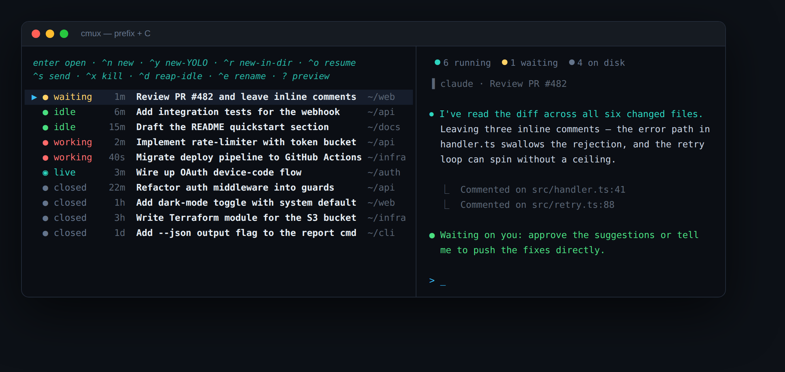
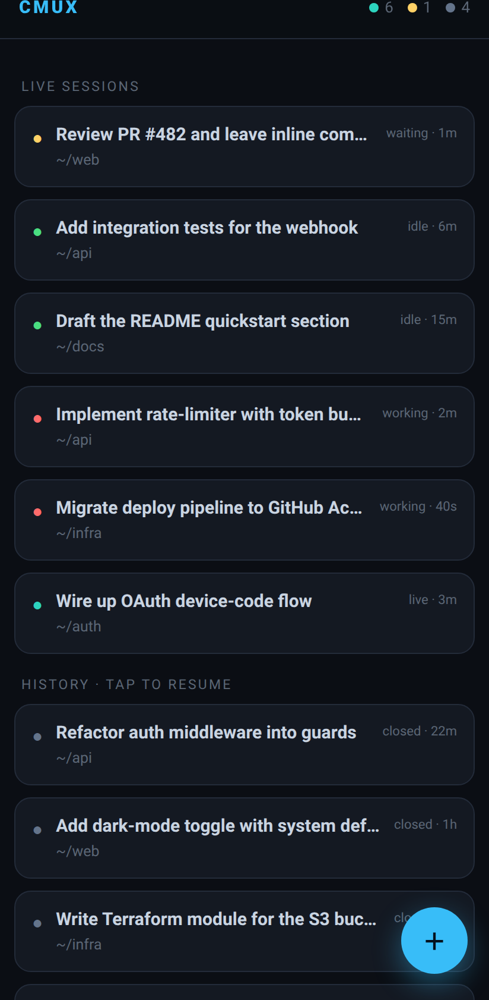

<div align="center">

# cmux

**A one-stop [tmux](https://github.com/tmux/tmux) session manager for [Claude Code](https://claude.com/claude-code).**

One command to see every Claude session — live and closed — with status and a
one-line description, jump into any of them, start new ones, resume old
conversations, and drive it all from your phone.

`bash` · `fzf` · zero required config · works with sessions you started by hand

<br>



</div>

```
   ██████╗███╗   ███╗██╗   ██╗██╗  ██╗     ●  waiting   needs your input
  ██╔════╝████╗ ████║██║   ██║╚██╗██╔╝     ●  idle      finished — your turn
  ██║     ██╔████╔██║██║   ██║ ╚███╔╝      ●  working   busy, leave it be
  ██║     ██║╚██╔╝██║██║   ██║ ██╔██╗      ●  live      running (no hooks)
  ╚██████╗██║ ╚═╝ ██║╚██████╔╝██╔╝ ██╗     ●  closed    on disk, resumable
   ╚═════╝╚═╝     ╚═╝ ╚═════╝ ╚═╝  ╚═╝
```

## Why

If you run Claude per-project, you quickly end up with a dozen tmux sessions and
no idea which are done, which are blocked on you, or what each one was even
doing. Existing pickers list *prefixed* sessions and need hooks to show anything
useful. `cmux` goes further:

- **Finds every Claude session automatically** — even ones you started by hand in
  a random tmux window. It matches by the live `claude` process, not just a name
  prefix, so nothing is invisible.
- **Shows a real one-line description** for each session — Claude's own
  AI-generated title, pulled from the transcript. No more `claude-a1b2c3d4`.
- **Surfaces your whole history**, not just what's running. Every past
  conversation is one keystroke from resuming in a fresh tmux session.
- **Runs from your phone.** `cmux web` serves a mobile dashboard with live status,
  previews, prompt-sending, and one-tap resume.

## Features

| | |
|---|---|
| 🔎 **Auto-detect** | Finds all Claude sessions by their live process — zero config, no naming convention required. |
| 🏷️ **Descriptions** | One-line AI title per session, parsed straight from the on-disk transcript. |
| 🟢 **Live status** | `working` / `waiting` / `idle` via optional Claude Code hooks; sorts the ones needing you to the top. |
| 👁️ **Live preview** | See each session's screen (running) or its last turns (closed) in a side pane. |
| ➕ **New sessions** | Start in the current dir, in a picked project, or with **YOLO mode** (`--dangerously-skip-permissions`). |
| ↺ **Resume history** | Reopen any past conversation in a fresh tmux session (`--fork-session`, original kept intact). |
| ⌨️ **Send prompts** | Type a prompt straight into a running session from the picker. |
| 🧹 **Reap & kill** | Kill one session or every finished one at once. |
| 📱 **Web dashboard** | Phone-friendly, zero-dependency, token-guarded. |
| ⚡ **Fast** | mtime-keyed parse cache keeps the picker snappy across hundreds of histories. |

## Install

**Requirements:** `tmux ≥ 3.2`, `fzf`, `jq`, `bash`; `python3` for the web
dashboard (all stdlib). macOS or Linux.

**One line — clones, links `cmux`, wires hooks + the tmux plugin:**

```sh
curl -fsSL https://raw.githubusercontent.com/seemandhar/cmux/master/install.sh | bash -s -- --all
```

<details>
<summary>Prefer to do it by hand?</summary>

```sh
git clone https://github.com/seemandhar/cmux ~/.cmux
~/.cmux/install.sh            # symlink `cmux` into ~/.local/bin
~/.cmux/install.sh --all      # + wire status hooks + add the tmux plugin
```
</details>

Then just run `cmux`. Check your setup any time with `cmux doctor`.

<details>
<summary>As a tmux plugin (tpm)</summary>

```tmux
set -g @plugin 'seemandhar/cmux'
```

or manually in `~/.tmux.conf`:

```tmux
run-shell ~/.cmux/cmux.tmux
```

Binds `prefix + C` (open manager) and `prefix + N` (new session here).
</details>

## Usage

Run `cmux` with no arguments to open the manager. Inside it:

| Key | Action |
|-----|--------|
| `enter` | Open — attach/jump to a live session, or resume a closed one |
| `ctrl-n` | **N**ew session in the current directory |
| `ctrl-y` | New session in **Y**OLO mode (skip all permission prompts) |
| `ctrl-r` | New session in another project (pick a directory) |
| `ctrl-s` | **S**end a prompt to the highlighted running session |
| `ctrl-x` | Kill the highlighted session |
| `ctrl-d` | Reap every finished (idle/done) session |
| `ctrl-e` | R**e**name the highlighted session |
| `ctrl-w` | How to start the phone dashboard |
| `?` | Toggle the preview pane |
| type to filter | fuzzy-search across titles and paths |

### One-shot commands

```sh
cmux              # open the interactive manager (default)
cmux ls           # plain-text list (no fzf; great over a flaky SSH link)
cmux new [dir]    # start a session in dir (default: current directory)
cmux yolo [dir]   # start a session with --dangerously-skip-permissions
cmux resume       # pick a past conversation and reopen it
cmux reap         # kill every finished session
cmux web [port]   # phone dashboard (default port 8790)
cmux doctor       # check dependencies + hook wiring
cmux json         # machine-readable session list (for scripting)
```

## Phone access 📱



```sh
cmux web
```

By default it binds to `localhost` and prints an SSH-tunnel command — open the
tunnel from your phone (e.g. [Termius](https://termius.com), Blink) and browse
the URL. On a trusted network you can bind directly with `cmux web --lan`.

The dashboard shows every session with live status and description, lets you tap
in to see a preview, **send a prompt**, **kill**, **resume** a past conversation,
or **start a new session** — all guarded by a random per-run token printed at
startup. It's plain Python stdlib: no `pip install`, nothing to build.

## Live status (optional but recommended)

Status comes from [Claude Code hooks](https://code.claude.com/docs/en/hooks)
that stamp each session's state (and link it to its transcript) onto tmux.
Without them, `cmux` still lists, previews, jumps, resumes, and kills — running
sessions just show `live` instead of `working`/`waiting`/`idle`.

```sh
~/.cmux/install.sh --hooks    # merges into ~/.claude/settings.json (backs it up)
```

Prefer to do it by hand? See [`hooks/settings-snippet.json`](hooks/settings-snippet.json).

## How it works

```
                       ┌──────────────┐
   tmux list-sessions ─┤              │  live sessions: one tmux call reads
   ps (claude ttys)  ──┤   core.sh    │  session fields + @cmux_* options;
                       │  (data layer)│  ps maps ttys to find hand-started ones
 ~/.claude/projects ───┤              │  closed sessions: transcripts, parsed
       *.jsonl         └──────┬───────┘  (bounded reads) + mtime-keyed cache
                              │
              ┌───────────────┼───────────────┐
        ┌─────┴─────┐   ┌─────┴─────┐   ┌──────┴──────┐
        │ picker.sh │   │  tmux.sh  │   │ web/server  │
        │  (fzf UI) │   │  (ops)    │   │  (phone)    │
        └───────────┘   └───────────┘   └─────────────┘
```

Every component reads the same tab-separated record stream from `core.sh`, so
the TUI, the plain list, and the web dashboard can never disagree. Descriptions
come from the `ai-title` line Claude writes into each transcript; if that's
missing, `cmux` falls back to the last prompt, then the first.

## Configuration

Set as tmux options (`set -g @cmux_… value`) or environment variables:

| tmux option | env var | default | meaning |
|---|---|---|---|
| `@cmux_prefix` | `CMUX_PREFIX` | `claude-` | name prefix for sessions cmux creates |
| `@cmux_command` | `CMUX_COMMAND` | `claude` | the command to launch |
| `@cmux_popup_w` / `_h` | `CMUX_POPUP_W/H` | `92%` | popup size |
| `@cmux_max_closed` | `CMUX_MAX_CLOSED` | `250` | history entries to scan |
| `@cmux_key` / `@cmux_new_key` | — | `C` / `N` | plugin keybindings |
| `@cmux_notify` | — | `off` | `on` → desktop notification when a session starts waiting on you |

## Tests

```sh
test/test-core.sh    # data-layer unit tests — parsing, caching, field alignment
```

## Credits

Inspired by
[craftzdog/tmux-claude-session-manager](https://github.com/craftzdog/tmux-claude-session-manager).
`cmux` rethinks it around process-based auto-detection, on-disk history, AI
descriptions, and phone access. MIT licensed.
